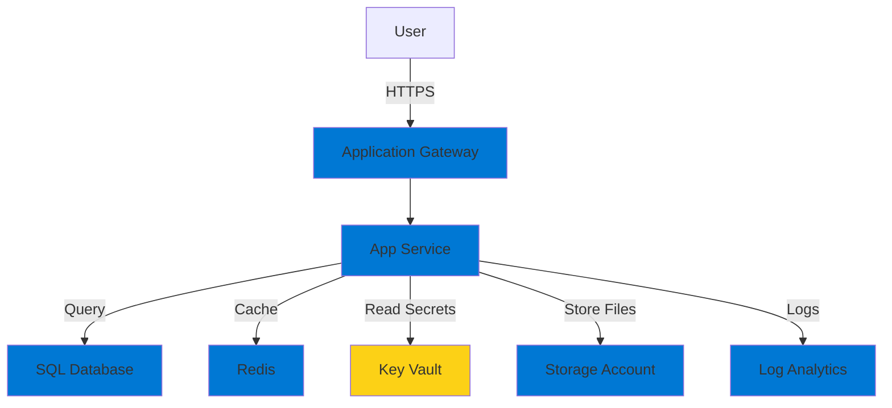

# Tesoro XP - Architecture Diagram Guide

This guide provides a text-based architecture diagram and instructions for creating a visual version using free tools.

---

## Text-Based Architecture Diagram

```
┌─────────────────────────────────────────────────────────────────────────────┐
│                              INTERNET / USERS                                │
│                         (HTTPS Traffic - Port 443)                           │
└───────────────────────────────────┬─────────────────────────────────────────┘
                                    │
                                    │ [TLS 1.2+]
                                    │
┌───────────────────────────────────▼─────────────────────────────────────────┐
│                         APPLICATION GATEWAY                                  │
│                    (Layer 7 Load Balancer + WAF)                            │
│  ┌────────────────────────────────────────────────────────────────────┐    │
│  │  • SSL/TLS Termination                                              │    │
│  │  • Web Application Firewall (OWASP Top 10 Protection)              │    │
│  │  • DDoS Protection                                                  │    │
│  │  • Path-based routing: /api → API Service                          │    │
│  └────────────────────────────────────────────────────────────────────┘    │
└───────────────────────────────────┬─────────────────────────────────────────┘
                                    │
                                    │ Private IP
                                    │
┌───────────────────────────────────▼─────────────────────────────────────────┐
│                        VIRTUAL NETWORK (10.0.0.0/16)                        │
│                                                                               │
│  ┌─────────────────────────────────────────────────────────────────────┐   │
│  │  APP SERVICE SUBNET (10.0.1.0/24)                                    │   │
│  │  ┌──────────────────────────────────────────────────────────────┐   │   │
│  │  │  APP SERVICE PLAN (Linux, S1 Standard)                        │   │   │
│  │  │  ┌────────────────────────────────────────────────────────┐  │   │   │
│  │  │  │  Tesoro Web App (.NET 8.0)                              │  │   │   │
│  │  │  │  • Auto-scaling: 1-5 instances                          │  │   │   │
│  │  │  │  • Always On enabled                                    │  │   │   │
│  │  │  │  • Deployment Slots: production, staging                │  │   │   │
│  │  │  │  • Health Check: /health endpoint                       │  │   │   │
│  │  │  │  • Managed Identity: app-identity                       │  │   │   │
│  │  │  └────────────────────────────────────────────────────────┘  │   │   │
│  │  └──────────────────────────────────────────────────────────────┘   │   │
│  │                                                                       │   │
│  │  [Network Security Group]                                            │   │
│  │  • Allow HTTPS (443) from Application Gateway                       │   │
│  │  • Allow outbound to Private Endpoints subnet                       │   │
│  │  • Deny all other traffic                                           │   │
│  └─────────────────────────────────────────────────────────────────────┘   │
│                                                                               │
│                                    │                                          │
│                                    │ Private Connection                       │
│                                    │                                          │
│  ┌─────────────────────────────────▼───────────────────────────────────┐   │
│  │  PRIVATE ENDPOINTS SUBNET (10.0.3.0/24)                              │   │
│  │                                                                       │   │
│  │  ┌──────────────────┐  ┌──────────────────┐  ┌─────────────────┐  │   │
│  │  │  SQL Database    │  │  PostgreSQL      │  │  Redis Cache    │  │   │
│  │  │  Private Endpoint│  │  Private Endpoint│  │  Private Endpoint│ │   │
│  │  │  (10.0.3.4)      │  │  (10.0.3.5)      │  │  (10.0.3.6)     │  │   │
│  │  └────────┬─────────┘  └────────┬─────────┘  └────────┬────────┘  │   │
│  │           │                     │                      │            │   │
│  │           │ Private Link        │ Private Link         │ Private Link
│  │           │                     │                      │            │   │
│  └───────────┼─────────────────────┼──────────────────────┼────────────┘   │
└───────────────┼─────────────────────┼──────────────────────┼────────────────┘
                │                     │                      │
                │                     │                      │
┌───────────────▼─────────────────────▼──────────────────────▼────────────────┐
│                           DATA LAYER (PaaS Services)                         │
│                                                                               │
│  ┌─────────────────────┐  ┌─────────────────────┐  ┌──────────────────┐   │
│  │  AZURE SQL DATABASE │  │  POSTGRESQL SERVER  │  │  REDIS CACHE     │   │
│  │  ────────────────── │  │  ──────────────────  │  │  ──────────────  │   │
│  │  SKU: Basic         │  │  SKU: Burstable B1ms│  │  SKU: Standard C1│   │
│  │  Size: 2 GB         │  │  Storage: 32 GB     │  │  Size: 1 GB      │   │
│  │  Backup: 7 days     │  │  Backup: 7 days     │  │  Replication: On │   │
│  │                     │  │                     │  │                  │   │
│  │  Stores:            │  │  Stores:            │  │  Caches:         │   │
│  │  • User accounts    │  │  • Analytics data   │  │  • Session data  │   │
│  │  • Transactions     │  │  • Audit logs       │  │  • Point balances│   │
│  │  • Point balances   │  │  • Reports          │  │  • API responses │   │
│  │  • Rewards catalog  │  │                     │  │  • Rate limiting │   │
│  └─────────────────────┘  └─────────────────────┘  └──────────────────┘   │
└───────────────────────────────────────────────────────────────────────────────┘


┌───────────────────────────────────────────────────────────────────────────────┐
│                           SECURITY & IDENTITY LAYER                           │
│                                                                               │
│  ┌──────────────────────────────┐      ┌──────────────────────────────┐    │
│  │   AZURE KEY VAULT            │      │   MANAGED IDENTITIES         │    │
│  │   ──────────────────          │      │   ───────────────────         │    │
│  │   • SQL Connection Strings    │◄─────┤   • app-identity             │    │
│  │   • PostgreSQL Passwords      │      │   • db-identity              │    │
│  │   • Redis Access Keys         │      │   • container-identity       │    │
│  │   • API Keys (SendGrid, etc)  │      │                              │    │
│  │   • JWT Signing Keys          │      │   (No passwords needed!)     │    │
│  │   • SSL Certificates          │      └──────────────────────────────┘    │
│  │                               │                                           │
│  │   RBAC:                       │                                           │
│  │   • app-identity: Secrets User│                                           │
│  │   • Developers: Secrets Reader│                                           │
│  └──────────────────────────────┘                                            │
└───────────────────────────────────────────────────────────────────────────────┘


┌───────────────────────────────────────────────────────────────────────────────┐
│                            STORAGE LAYER                                      │
│                                                                               │
│  ┌────────────────────────────────────────────────────────────────────────┐  │
│  │  STORAGE ACCOUNT (Standard LRS)                                         │  │
│  │  ──────────────────────────────                                         │  │
│  │                                                                          │  │
│  │  [Blob Containers]                                                      │  │
│  │  • profile-pictures/    → User avatars                                 │  │
│  │  • reward-images/       → Product photos                               │  │
│  │  • receipts/            → Uploaded receipts for verification           │  │
│  │  • exports/             → Generated reports (CSV, PDF)                 │  │
│  │  • backups/             → Database backups                             │  │
│  │                                                                          │  │
│  │  [Queue Storage]                                                        │  │
│  │  • email-queue          → Async email processing                       │  │
│  │  • points-calculation   → Batch point updates                          │  │
│  │                                                                          │  │
│  │  Access: Private only, SAS tokens for temporary access                 │  │
│  │  Encryption: AES-256 at rest, TLS 1.2 in transit                       │  │
│  └────────────────────────────────────────────────────────────────────────┘  │
└───────────────────────────────────────────────────────────────────────────────┘


┌───────────────────────────────────────────────────────────────────────────────┐
│                       MONITORING & OBSERVABILITY LAYER                        │
│                                                                               │
│  ┌──────────────────────────────────────────────────────────────────────┐   │
│  │  LOG ANALYTICS WORKSPACE                                              │   │
│  │  ────────────────────────                                             │   │
│  │  Collects logs from all services:                                    │   │
│  │  • App Service HTTP logs, Application logs                           │   │
│  │  • SQL Database audit logs, slow queries                             │   │
│  │  • PostgreSQL logs                                                    │   │
│  │  • NSG flow logs (network traffic)                                   │   │
│  │  • Key Vault access logs                                             │   │
│  │  • Redis Cache diagnostics                                           │   │
│  │                                                                        │   │
│  │  Retention: 30 days                                                   │   │
│  │  Daily Cap: 1 GB to control costs                                    │   │
│  └──────────────────────────────────────────────────────────────────────┘   │
│                                                                               │
│  ┌──────────────────────────────────────────────────────────────────────┐   │
│  │  APPLICATION INSIGHTS                                                 │   │
│  │  ────────────────────                                                 │   │
│  │  • Request tracking (latency, status codes)                          │   │
│  │  • Dependency tracking (SQL queries, Redis calls)                    │   │
│  │  • Exception tracking with stack traces                              │   │
│  │  • Custom events (RewardRedeemed, PointsEarned)                      │   │
│  │  • Distributed tracing across services                               │   │
│  │  • Availability tests from 5 global regions                          │   │
│  └──────────────────────────────────────────────────────────────────────┘   │
│                                                                               │
│  ┌──────────────────────────────────────────────────────────────────────┐   │
│  │  ALERTS & ACTIONS                                                     │   │
│  │  ─────────────────                                                    │   │
│  │  [Metric Alerts]                                                      │   │
│  │  • CPU > 80% for 15 minutes      → Email DevOps team                │   │
│  │  • Memory > 90%                   → SMS + Auto-scale                 │   │
│  │  • Response time > 5s             → Slack notification               │   │
│  │  • HTTP 5xx > 10/min              → Create incident ticket           │   │
│  │  • Database DTU > 80%             → Email + dashboard alert          │   │
│  │                                                                        │   │
│  │  [Action Groups]                                                      │   │
│  │  • tesoro-dev-ag:  Email to devops-team@tesoro.com                  │   │
│  │  • budget-alert-email: Cost alerts to dennis.brady@...              │   │
│  └──────────────────────────────────────────────────────────────────────┘   │
│                                                                               │
│  ┌──────────────────────────────────────────────────────────────────────┐   │
│  │  WORKBOOKS (Dashboards)                                               │   │
│  │  ───────────────────────                                              │   │
│  │  • Operations Dashboard:  Real-time metrics, error rates             │   │
│  │  • Executive Dashboard:   KPIs (users, points, rewards)              │   │
│  │  • Cost Dashboard:        Spending by service, projections           │   │
│  │  • Security Dashboard:    Failed logins, anomalies                   │   │
│  └──────────────────────────────────────────────────────────────────────┘   │
└───────────────────────────────────────────────────────────────────────────────┘


┌───────────────────────────────────────────────────────────────────────────────┐
│                         CI/CD & DEPLOYMENT LAYER                              │
│                                                                               │
│  ┌────────────────────────────────────────────────────────────────────────┐  │
│  │  GITHUB REPOSITORY                                                      │  │
│  │  ──────────────────                                                     │  │
│  │  • infrastructure/bicep/     → Infrastructure as Code                 │  │
│  │  • .github/workflows/        → CI/CD pipelines                        │  │
│  │  • docs/                     → Architecture, runbooks                 │  │
│  └────────────────────────────────────────────────────────────────────────┘  │
│                                    │                                          │
│                                    │ Git Push                                 │
│                                    ▼                                          │
│  ┌────────────────────────────────────────────────────────────────────────┐  │
│  │  GITHUB ACTIONS                                                         │  │
│  │  ───────────────                                                        │  │
│  │                                                                          │  │
│  │  [Infrastructure Pipeline]                                              │  │
│  │  1. Bicep validation (linting, what-if)                                │  │
│  │  2. Deploy to dev environment                                          │  │
│  │  3. Run smoke tests                                                    │  │
│  │  4. Manual approval for staging                                        │  │
│  │  5. Deploy to staging                                                  │  │
│  │  6. Integration tests                                                  │  │
│  │  7. Manual approval for production                                     │  │
│  │  8. Blue-green deployment to production                                │  │
│  │                                                                          │  │
│  │  [Application Pipeline]                                                 │  │
│  │  1. Build .NET application                                             │  │
│  │  2. Run unit tests                                                     │  │
│  │  3. Security scan (SAST with Snyk)                                     │  │
│  │  4. Build Docker image                                                 │  │
│  │  5. Deploy to staging slot                                             │  │
│  │  6. Run automated tests                                                │  │
│  │  7. Swap staging → production (zero downtime)                          │  │
│  │                                                                          │  │
│  │  Authentication: OIDC (OpenID Connect) - no secrets in GitHub!         │  │
│  └────────────────────────────────────────────────────────────────────────┘  │
└───────────────────────────────────────────────────────────────────────────────┘


┌───────────────────────────────────────────────────────────────────────────────┐
│                            COST MANAGEMENT                                    │
│                                                                               │
│  ┌────────────────────────────────────────────────────────────────────────┐  │
│  │  BUDGETS & ALERTS                                                       │  │
│  │  ──────────────────                                                     │  │
│  │  Budget: $100/month                                                    │  │
│  │  Alerts:                                                                │  │
│  │    • 50% ($50)  → Warning email                                        │  │
│  │    • 75% ($75)  → Warning email + Slack                                │  │
│  │    • 90% ($90)  → Critical alert + SMS                                 │  │
│  │    • 100% ($100) → Forecast alert (prediction)                         │  │
│  │                                                                          │  │
│  │  Cost Allocation Tags:                                                  │  │
│  │    • environment: dev / staging / production                           │  │
│  │    • costCenter: engineering                                           │  │
│  │    • application: tesoro-xp                                            │  │
│  └────────────────────────────────────────────────────────────────────────┘  │
└───────────────────────────────────────────────────────────────────────────────┘
```

---

## Component Summary Table

| Layer | Component | Purpose | SKU/Tier | Monthly Cost |
|-------|-----------|---------|----------|--------------|
| **Compute** | App Service Plan | Host web application | S1 Standard | $70 |
| **Compute** | App Service | Tesoro web app (.NET 8) | - | Included |
| **Data** | SQL Database | Transactional data | Basic 2GB | $5 |
| **Data** | PostgreSQL | Analytics data | Burstable B1ms | $15 |
| **Data** | Redis Cache | Session & caching | Standard C1 | $75 |
| **Network** | Virtual Network | Private networking | Standard | Free |
| **Network** | NSGs | Firewall rules | Standard | Free |
| **Network** | Private Endpoints | Secure connectivity | Standard | $22 (3x $7.30) |
| **Security** | Key Vault | Secrets management | Standard | $1 |
| **Security** | Managed Identities | Passwordless auth | - | Free |
| **Storage** | Storage Account | Files, blobs, queues | Standard LRS | $2 |
| **Monitor** | Log Analytics | Centralized logging | Pay-as-you-go | $3 |
| **Monitor** | Application Insights | APM & tracing | Pay-as-you-go | Included |
| **Monitor** | Action Groups | Alert notifications | Standard | Free |
| **CI/CD** | GitHub Actions | Pipelines | Free tier | Free |
| | | **TOTAL** | | **~$193/month** |

*Note: Costs are estimates for dev environment in US East region*

---

## Data Flow Diagram

```
┌──────────┐
│  User    │
└────┬─────┘
     │ 1. HTTPS Request
     │    GET /api/rewards
     ▼
┌────────────────┐
│ App Gateway    │ 2. WAF inspection
│ (WAF)          │    SSL termination
└────┬───────────┘
     │ 3. Forward to App Service
     │    (Private IP)
     ▼
┌────────────────┐
│ App Service    │ 4. Check Redis cache
│ (.NET App)     ├──────►┌──────────┐
└────┬───────────┘       │  Redis   │ 5. Cache miss
     │                   └──────────┘
     │ 6. Query database
     ▼
┌────────────────┐
│ SQL Database   │ 7. Return data
│ (Private)      │
└────┬───────────┘
     │ 8. Update cache
     │
     ▼
┌────────────────┐
│ Redis Cache    │ 9. Cache for 15 min
└────────────────┘
     │ 10. Return response
     │
     ▼
┌────────────────┐
│ App Service    │ 11. Log to App Insights
└────┬───────────┘
     │ 12. HTTP 200 OK
     ▼
┌────────────────┐
│ User           │ 13. Display rewards
└────────────────┘

[All steps logged to Log Analytics and Application Insights]
```

---

## Security Architecture

```
        ┌─────────────────────────────────────┐
        │       DEFENSE IN DEPTH               │
        │    (Multiple Security Layers)        │
        └─────────────────────────────────────┘

Layer 7: Application Security
├── WAF (OWASP Top 10 Protection)
├── API Authentication (JWT)
├── Input Validation
└── HTTPS Only

Layer 6: Identity & Access
├── Managed Identities (No passwords)
├── RBAC (Least privilege)
├── Key Vault (Secrets management)
└── Azure AD Integration

Layer 5: Network Security
├── Private Endpoints (No internet exposure)
├── NSGs (Firewall rules)
├── VNet Isolation
└── No public IPs on data services

Layer 4: Data Security
├── TDE (Transparent Data Encryption)
├── Encryption at rest (AES-256)
├── Encryption in transit (TLS 1.2+)
├── Automated backups
└── Point-in-time restore

Layer 3: Monitoring & Threat Detection
├── Azure Defender for Cloud
├── SQL Advanced Threat Protection
├── NSG Flow Logs
├── Key Vault Audit Logs
└── Anomaly Detection

Layer 2: Compliance
├── PCI DSS (Payment data)
├── GDPR (User data privacy)
├── Audit logs retained 90 days
└── Regular security scans

Layer 1: Business Continuity
├── Geo-redundant storage
├── SQL Database geo-replication
├── Automated backups (7-35 days)
└── Infrastructure as Code (IaC)
```

---

## How to Create Visual Diagrams

### Option 1: Draw.io (Free, Recommended)

1. Go to https://app.diagrams.net/
2. Choose "Create New Diagram"
3. Select "Azure" template
4. Drag and drop Azure icons:
   - **Network** section: VNet, NSG, Application Gateway
   - **Compute** section: App Service
   - **Databases** section: SQL Database, PostgreSQL, Redis
   - **Security** section: Key Vault
   - **Storage** section: Storage Account
   - **Monitor** section: Log Analytics, Application Insights

5. **Azure Icon Library**:
   - Go to File → Open Library From → Search "Azure"
   - Use official Microsoft Azure icons

6. **Tips**:
   - Use containers (rectangles) for VNet and subnets
   - Use arrows to show data flow
   - Color code by layer (blue=network, green=data, orange=security)
   - Add text boxes for key details (SKUs, IP addresses)

7. Export as PNG or PDF for presentations

### Option 2: Microsoft Visio (If you have it)

1. Open Visio
2. Search for "Azure Architecture" template
3. Similar drag-and-drop process
4. Has all official Azure shapes/icons

### Option 3: Lucidchart (Free tier available)

1. Go to https://www.lucidchart.com/
2. Create account (free tier is sufficient)
3. Import Azure shape library
4. Drag and drop components

### Option 4: Azure Architecture Icons (Download)

Microsoft provides official Azure icons for free:

1. Download from: https://learn.microsoft.com/en-us/azure/architecture/icons/
2. Use in PowerPoint, Keynote, or any design tool
3. Create your own custom diagram

### Option 5: Mermaid (Code-based diagrams in GitHub)

Add this to your README.md on GitHub for auto-generated diagrams:



---

## Presentation Tips

When showing this architecture in interviews:

### Start High-Level
"This is a multi-tier loyalty rewards platform on Azure with defense-in-depth security."

### Walk Through User Request Flow
"When a user requests rewards, traffic flows through Application Gateway with WAF protection, routes to App Service in a private subnet, checks Redis cache first for performance, falls back to SQL Database if cache miss, and all operations are logged to Application Insights."

### Highlight Key Decisions
- "I chose Private Endpoints to eliminate internet exposure for data services"
- "Redis cache reduces database load by 80% for read-heavy operations"
- "Managed Identities eliminate credential management"
- "Infrastructure as Code allows full environment recreation in 20 minutes"

### Discuss Trade-offs
- "Basic SQL tier for dev saves cost but limits performance - would use Premium or Hyperscale in production"
- "Standard App Service enables VNet integration and deployment slots for zero-downtime deployments"

### Mention What's Not Shown
- "Not shown: Application Gateway in production would have auto-scaling and zone redundancy"
- "Production would add Azure Front Door for global CDN and DDoS protection"
- "Would implement Azure DevOps or GitHub Actions for automated deployments"

---

## Summary

This architecture demonstrates:

✅ **Cloud-Native Design**: Leveraging PaaS services for managed infrastructure
✅ **Security Best Practices**: Defense in depth, zero trust, private networking
✅ **High Availability**: Auto-scaling, deployment slots, geo-replication
✅ **Observability**: Comprehensive logging, monitoring, and alerting
✅ **Cost Optimization**: Right-sized SKUs, budget alerts, auto-scaling
✅ **DevOps Culture**: IaC, CI/CD pipelines, automated testing
✅ **Compliance Ready**: PCI DSS, GDPR, audit logging

**Perfect for demonstrating Azure expertise in job interviews!**
